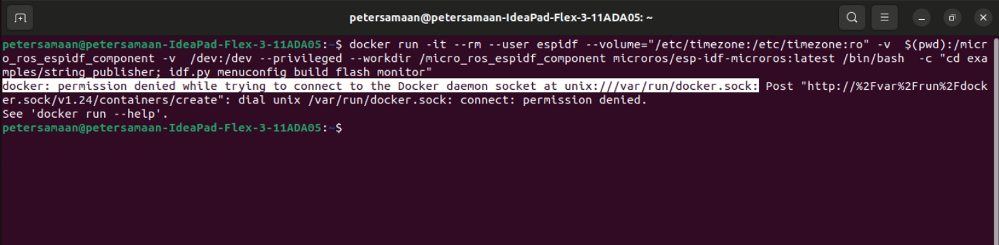
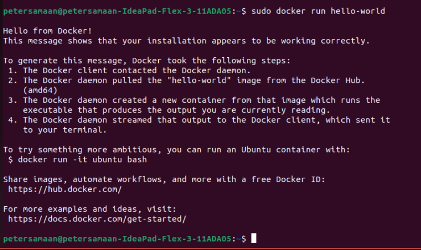
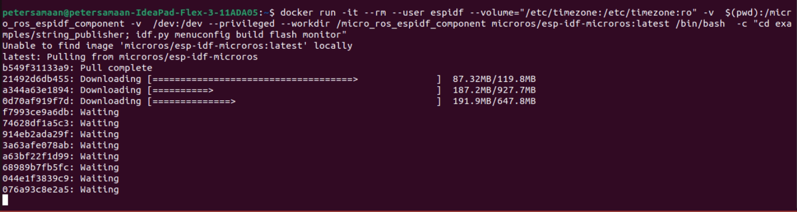
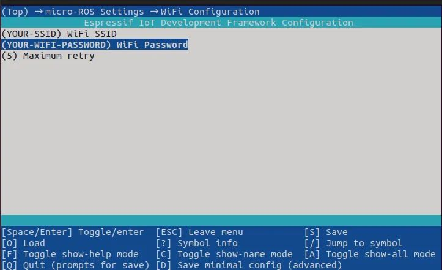
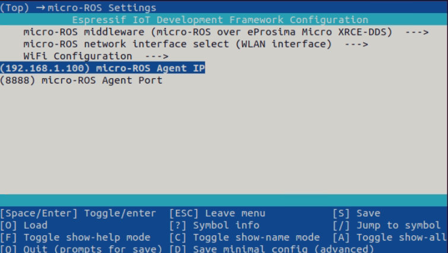
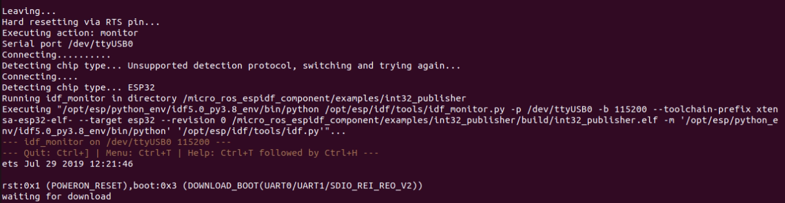
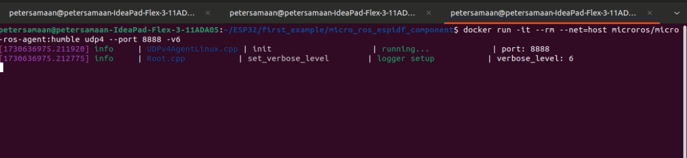

# micro-ROS component for ESP-IDF

This component has been tested in ESP-IDF v4.4, and v5.2 with ESP32, ESP32-S2, ESP32-S3 and ESP32-C3.

## Pre Acquisitions
* Ubuntu (at least 22.04) 
* ROS2 Humble:

    Installation of ROS2 humbe can be done following the steps [here](https://docs.ros.org/en/humble/Installation/Alternatives/Ubuntu-Development-Setup.html).
* `colcon` and other Python 3 packages inside the IDF virtual environment in order to build micro-ROS packages:
    ```bash
    . $IDF_PATH/export.sh
    pip3 install catkin_pkg lark-parser colcon-common-extensions empy==3.3.4
    ```
* docker:

    follow the stepes [here](https://docs.docker.com/engine/install/ubuntu/).
* ESP32-WROOM-32# board (v5 max).
## Middlewares available

This package support the usage of micro-ROS on top of two different middlewares:
- [eProsima Micro XRCE-DDS](https://micro-xrce-dds.docs.eprosima.com/en/latest/): the default micro-ROS middleware.
- [embeddedRTPS](https://github.com/embedded-software-laboratory/embeddedRTPS): an experimental implementation of a RTPS middleware compatible with ROS 2.

In order to select it, use `idf.py menuconfig` and go to `micro-ROS Settings > micro-ROS middleware`

## Usage
It is important to follow both *"Installing a Micro-Ros Agent on a ESP32 (blinking and LED)"* and *"ESP32 controlling RS 907-5965 via Micro-Ros Agent over WiFi"* documents for step-by-step building and running the codes, along with important comments on the code for further modifications.

* Clone this repo and run the following command to build and flash the desired example using preconfigured docker container *(don't foget to connect your board)*. Execute this line to build an example app using docker container: 
    ```bash
    docker run -it --rm --user root     --volume="/etc/timezone:/etc/timezone:ro"     -v $(pwd):/micro_ros_espidf_component     -v /dev:/dev --privileged     --workdir /micro_ros_espidf_component/examples/beacon_subs     microros/esp-idf-microros:latest /bin/bash -c "idf.py menuconfig build flash monitor"
    ```
    Mind the part ```examples/beacon_subs``` indicates the desied example to be run.

    Dockerfile for this container is provided in the ./docker directory and available in dockerhub. This approach uses ESP-IDF v5.

* If you encounter issues during the build process, ensure that you are running in a clean shell environment _without_ the ROS 2 setup script sourced.


* If you find the following error:
  , this means that your Docker software does not have the root user permissions. Follow these steps to fix the issue:
  1. Create the `docker` group if it does not exist:
     ```bash
     sudo groupadd docker
     ```
  2. Add your user to the `docker` group:
     ```bash
     sudo usermod -aG docker $USER
     ```
  3. Log in to the new `docker` group (to avoid having to log out / log in again; but if not enough, try to reboot):
     ```bash
     newgrp docker
     ```
  4. Check if Docker can be run without root:
     ```bash
     docker run hello-world
     ```
  5. Reboot if you still encounter the error.
  
  If everything is done correctly, you should find the following screen after running `hello-world`:
  

* Run the docker buil and flasg ommand again, you should find the following screen:


* Configuer the ESP32 with your WiFi SSID and password, and the ip address of the machine that will run the micro-ros agent



* Save and exit, make sure to hold the boot button on your board if necessary. The build process should appear on screen and finalize with successful flashing of the project on the ESP32 board.

* Press ```ctrl + ]``` to end the process, disconnect the ESP32 board and connect it to an external power source.
* Run the micro-ros agent on your machine: 
    ```bash
    docker run -it --rm --net=host microros/micro-ros-agent:humble udp4 --port 8888 -v6
    ```
    It should show the following screen
    
    then this when the ESP32 board is detected 
    


## Examples for the Purpose of the Project

The initial software examples were not meant for production use. It had neither been developed nor
tested for a specific use case. However, the three examples added:
* beacon_control
* beacon_flicker
* beacon_subs

Were designed to control  beacon of model *RS 907-5965* 

 ### beacon_control
 The project has a publisher and a binary service, the publisher indicates the 
 case of the beacon (on / off), while calling the service with TRUE will 
 switch it to ON or change its mode is it is already ON, calling the service with OFF willswitch off the beacon. 

 ### beacon_flicker
 The project has a publisher and a binary service, the publisher indicates the 
 case of the beacon (on / off), while calling the service with TRUE will 
 switch it to ON or change its flickering frequency (0 to 10 times per second). 
 For this project it is essential to pre-fix the beacon mode at Constant light mode.

### beacon_subs
 The project uses thetopic of the *local_publisher* (a ros2 publisher included in the examples) to control the fliskering intervals of the beacon according to the published values, curently the values published are from 0 to 100, incrementing by 10 each 10 seconds to allow for testing and monitoring the final behavior.


## Using serial transport

By default, micro-ROS component uses UDP transport, but is possible to enable UART transport or any other custom transport setting the `colcon.meta` like:

```json
...
"rmw_microxrcedds": {
    "cmake-args": [
        ...
        "-DRMW_UXRCE_TRANSPORT=custom",
        ...
    ]
},
...
```

An example on how to implement this external transports is available in `examples/int32_publisher_custom_transport`.

Available ports are `0`, `1` and `2` corresponding `UART_NUM_0`, `UART_NUM_1` and `UART_NUM_2`.

Is possible to use a micro-ROS Agent just with this docker command:

```bash
# Serial micro-ROS Agent
docker run -it --rm -v /dev:/dev --privileged --net=host microros/micro-ros-agent:foxy serial --dev [YOUR BOARD PORT] -v6
```


## License

This repository is modified for and ow managed by Saxion University for Applied Science.

